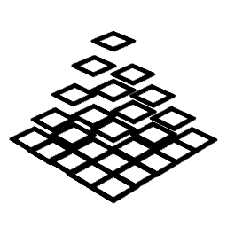
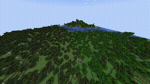
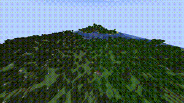

# Animated Chunks

An enhanced fork of [cadenkriese's mod](https://github.com/cadenkriese/smooth-chunks) for the latest versions of the game, with a completely different code base.

**NOTE: This mod WILL NOT support Sodium, since Sodium doesn't render separate chunks, but whole regions, hence separate chunk animations are rendered impossible. Anyone interested in making sodium compatibility, be my guest**

## What is this?

Animated Chunks is a Fabric mod that adds animations of currently loading chunks. This makes chunk loading generally seem much more pleasant than them appearing out of thin air. There are multiple built-in animations and ease types, and if this isnt't enough, there's an API which will allow you to add your own animations and eases (with ease :trollface:)

Generally, this is what you'd call an "eye-candy" mod.

### Currently supported animations:

Rise:

Fall:

Scale:

Fly in:

### Currently supported interpolation types:

- Linear
- Sine
- Quadratic
- Elastic

## Future plans

In the future, I plan to extend the scope of this mod to not only smoothen the chunk loading, but entity spawning/despawning/dying, liquid flowing, crops growing etc.

## License

This mod is under the [MIT License](./LICENSE).

